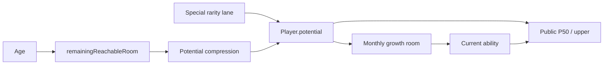
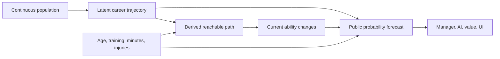

# Analysis - Why Generational Renewal Fails

## Scope And Population

This analysis combines Phase 81A L6.43B diagnostics, its real `7 x 10` and
`7 x 15` cohorts, direct production-code reading on 2026-08-17, and Graphify
`explain`/`affected` after rebuilding the uncommitted graph.

The measured five-star cohort is not the whole population. It diagnoses the
selected high-ceiling path but cannot establish renewal of ordinary and
middle-tier players. Phase 81B therefore treats it as causal evidence about the
old model, not as the only success population.

## Measured Findings

### Projection and outcome

The diagnostic cohort contains `173` selected young high-ceiling players over
seven worlds. Intake P50 is tightly concentrated:

- minimum `13.78`, P10 `14.00`, median `14.38`, P90 `14.76`, maximum `15.05`.

At fifteen seasons, the reported judgeable outcomes were:

- `69` reached role ability `13`;
- `38` reached `14`;
- `10` reached `15`;
- `0` reached `16`;
- observed maximum `15.39`.

This is not universal starvation. Exposure is above the frozen `0.50`
threshold across the measured population, with median near `0.82`.

### Timing of ceiling loss

Among `154` judgeable players with both facts:

- `152` lost the `16` ceiling before sustained exposure;
- `2` lost it afterwards.

Median ceiling-loss year is approximately `2029`; median year reaching `0.50`
exposure is approximately `2033`. The model reduces the future limit about four
years before opportunity becomes sustained.

### Why `99.9%` conversion is ambiguous

The old final-bucket current-to-potential conversion is nearly `99.9%`. It
cannot distinguish a player developing up to a stable ceiling from a mutable
ceiling being compressed down to current level. `player-aging-policy.ts`
applies `max(current, min(previousPotential, reachableCeiling))`; high
conversion is therefore not evidence of genuine potential realization.

## Production Mechanism

### One field, four owners

`packages/domain/src/entities/player.entity.ts` persists `abilities` and
`potential`. The latter is read as:

- content-generated hidden ceiling;
- source for `derivePlayerPotentialProjection(...)`;
- growth room in `developOnePlayerMonth(...)`;
- mutable output of `applyPlayerAgingPolicy(...)`.

This is a shallow Interface: callers need to understand the Implementation's
temporary meaning of `potential`. The concept leaks into generation, engine,
market, storage, reports and UI.

### Ceiling-first, lane-driven generation

`buildContextualProspectJointProfile(...)` selects explicit ceiling classes and
constructs current ability inside their envelopes. `player-rarity-budget.ts`
allocates annual five/six-star assignments and stock top-ups. Opening seniors,
academy players and annual players have separate composition roots. They reuse
helpers but do not share one population law.

### Forecast is a fraction of mutable room

`derivePlayerPotentialProjection(...)` computes:

```text
remainingRoom = storedCeilingAbility - currentAbility
p50 = current + remainingRoom * ageBandP50Factor
upper = min(storedCeiling, current + remainingRoom * ageBandUpperFactor)
```

It does not estimate outcomes from an independent career model. Raising the
factor changes public optimism but creates no development.

### Aging compresses the same ceiling

`applyPlayerAgingPolicy(...)` derives `remainingReachableRoom(...)` from age
and ability family, then rewrites each potential attribute downward. This mixes
two valid concepts: innate career profile and what remains reachable now. The
second is derived; mutating the first creates the ratchet.

## Rejected Fixes

### Generate more five-star players

Rejected. It makes more labels inside the same broken path and risks
overpowering divisions. Football populations need starters, backups and late
bloomers, not fixed future stars per club.

### Raise P50/upper coefficients

Rejected by evidence. Projection already overstates most judgeable outcomes.
Coefficient inflation relabels; it does not repair career dynamics.

### Guarantee an elite successor per club

Rejected. It removes scarcity, competitive imbalance, transfer stories and
club evolution. Supply is statistical at national/division level.

### Let minutes determine hidden talent

Rejected. Selection would rewrite truth, and a late move could manufacture
innate talent. Minutes affect realization and remaining time.

### Penalize veteran goals/assists directly

Rejected. Output changes through abilities, condition and availability. A
leaderboard penalty would be a second aging formula.

### Preserve beta compatibility

Rejected. A legacy `potential` alias or fallback reconstruction creates dual
truth and dead code.

## Root Cause



The loop is self-referential. A stable hidden profile and derived reachable
path break it:



## Architectural Deepening

### Latent trajectory Module

One domain Module exposes only persisted, non-derivable career facts. Forecast
and development gain leverage without learning generation. Innate semantics
gain locality instead of living in four packages.

### Population policy Module

Opening seniors, academies and intake become adapters to one content-owned
Interface. Age, quantity and club context stay different; talent law does not.

### Public assessment Seam

`derivePublicPlayerAssessment(...)` remains the only public Seam. Its output
becomes an absolute probability distribution. Every market/UI caller receives
new semantics without hidden access.

### Recruitment-intent Interface

`deriveAiMarketNeeds(...)` already owns depth, quality, aging and succession.
Add a typed intent there rather than creating a parallel AI planner.

## Evidence Still Missing

Step 00 must collect, before implementation:

- ability pyramid by division for opening and generated players;
- outcomes by every public forecast class;
- intake volume, exits and active stock by role/division;
- market movement by source/destination and useful-level fit;
- reachability of each AI purchase intent;
- aging/retirement distribution by role;
- serious-injury branch reachability on real careers;
- opening-shape baselines for D2/D3 where no external target exists.

No number in this document silently fills those gaps.

